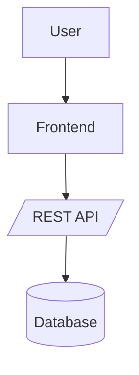

# CLAUDE.md — Multi-Agent Orchestration & Governance (Drop-In)

> Paste this file at the repo root. It defines how agents collaborate, which commands they own, quality gates, and the delivery workflow for **RadiusForge**. The companion files in `.claude/`, `ops/`, and `Makefile` make it runnable in CI or locally.

## 0) TL;DR — How to Use
- Talk only to **Main Orchestrator (MO)** via natural language or commands from the **Command Palette**.
- **MO** decomposes work and routes to agents per the **Delegation Matrix**.
- **Only the owning agent** responds to a command. Others stay silent unless MO @mentions them.

Example:
```
/feature "Add OAuth2 login"
```
Flow: MO → Thinker → **Designer** → Architect → Dev-BE + Dev-FE → Security → Testers → **Test Report Generator (TR)** → Code Reviewer → Docs → Bundle → Handoff.

---

## 1) Agent Roster
**Main Orchestrator (MO)** — Intake, plan, delegate, enforce gates, merge outputs, deliver. Never writes code.  
**Thinker** — Clarify intent, ACs, risks, success metrics.  
**Designer (UX/UI)** — User journeys, IA, wireframes, visual design guidelines, accessibility baseline.  
**Architect** — ADRs, diagrams, interfaces, data models, sequencing, non-functionals.  
**Developer – Backend (Dev-BE)** — Services/APIs, DB/migrations, IaC as needed.  
**Developer – Frontend (Dev-FE)** — UI/state/A11y, API integration.  
**Security Analyst (Sec)** — SA violations/vulns, threat model, SAST/DAST, remediations.  
**Code Reviewer (CR)** — Code quality, style, performance, architecture compliance.  
**Tester – Unit (TU)** — Deterministic unit tests, coverage.  
**Tester – Integration (TI)** — Contract & data-flow validation.  
**Tester – E2E (TF)** — ACs, user journeys, smoke/perf-lite.  
**Test Report Generator (TR)** — **Aggregates UT/INT/FT results; builds unified HTML/PDF test report, coverage summary, trends vs baseline; publishes artifact and links to run.**  
**Documentation (Doc)** — README/API/runbooks/release notes.  
**Final Bundle Generator (Bundle)** — Reproducible build, SBOM, checksums, manifest, rollback.

---

## 2) Command Palette (Single Source of Truth)
Only the designated agent responds to each command. MO triggers and routes.

| Command | Owner | Purpose |
|---|---|---|
| `/triage "<ask>"` | MO → Thinker | Clarify scope, ACs, risks. |
| `/design` | Designer | UX flows, wireframes, components, A11y baseline. |
| `/plan` | MO | Turn thinking/design into tasks & assignments. |
| `/arch` | Architect | ADRs, diagrams, interfaces, NFRs. |
| `/dev-be "<component>"` | Dev-BE | Backend implementation. |
| `/dev-fe "<component>"` | Dev-FE | Frontend implementation. |
| `/sec-scan` | Security | Threat model, SAST/DAST, remediations. |
| `/test-unit` | Tester-Unit | Unit tests & coverage. |
| `/test-int` | Tester-Integration | Integration tests. |
| `/test-e2e` | Tester-E2E | E2E tests vs ACs. |
| **`/test-report`** | **Test Report Generator** | **Collate UT/INT/FT outputs, compute coverage, generate HTML/PDF, publish.** |
| `/review` | Code Reviewer | Code review & approval. |
| `/docs` | Documentation | README/API/runbooks/releases. |
| `/bundle` | Bundle | Build artifacts, SBOM, checksums. |
| `/handoff` | MO | Summarize & link artifacts. |
| `/status` | MO | Progress, blockers, owners. |
| `/rollback "<version>"` | Bundle | Rollback bundle & guide. |

**Routing rule:** If a specialist command is invoked directly by a human, MO still acknowledges and routes it to the correct agent.

---

## 3) Delegation Matrix & Rule of Silence
- MO → Thinker for `/triage`  
- **MO → Designer for `/design` (before architecture)**  
- MO → Architect for `/arch` (uses Design outputs for contracts & NFRs)  
- MO → Dev-BE/Dev-FE for implementation based on Architecture & Design  
- MO → Security before/after significant changes  
- MO → Testers in order: `/test-unit` → `/test-int` → `/test-e2e`  
- **MO → Test Report Generator for `/test-report` (after tests green)**  
- MO → Code Reviewer after test report is published  
- MO → Docs after review approval  
- MO → Bundle when Security & Docs ✅  
- MO → Handoff last  

**Silence:** An agent speaks only when assigned a command by MO or @mentioned by MO.

---

## 4) Task Lifecycle (Quality Gates / DOD)
1. **Triage** — Problem, ACs, risks, metrics captured. **Gate:** ACs unambiguous.  
2. **Design** — Journeys, IA, wireframes, components, A11y rules. **Gate:** Key flows reviewed by MO; a11y baseline defined.  
3. **Architecture** — ADRs/diagrams/contracts approved. **Gate:** Security implications reviewed.  
4. **Implementation** — Dev-BE/FE code & unit tests. **Gate:** Lint/build pass, coverage ≥ baseline.  
5. **Security** — `/sec-scan` & fixes. **Gate:** No High/Critical without documented exception & mitigation.  
6. **Testing** — `/test-unit` → `/test-int` → `/test-e2e` green. **Gate:** ACs & primary journeys verified.  
7. **Reporting** — **`/test-report` produced by TR**. **Gate:** Coverage summary + pass/fail matrix + trend deltas attached to run.  
8. **Review** — `/review` approve or changes requested. **Gate:** CR approval.  
9. **Docs** — `/docs` updated. **Gate:** MO verifies completeness.  
10. **Bundle** — `/bundle` artifacts, SBOM, checksums, manifest. **Gate:** Reproducible build confirmed.  
11. **Handoff** — `/handoff` links artifacts, rollback, known risks, next steps. **Gate:** Stakeholder sign-off if needed.

---

## 5) Standard Output Template (All Agents)
```markdown
### Summary
- 3–6 bullets

### Artifacts
- path/or/link
- …

### Decisions
- decision — rationale

### Risks / Mitigations
- risk — mitigation

### Next Actions
- @owner: action (/command if applicable)
```
Architect may add Mermaid diagrams:


---

## 6) Security & Compliance (SA) — Minimum Bar
- Threat model delta; authN/authZ; secrets management  
- SAST + dependency scan summary (CVSS), DAST as feasible  
- Config hardening (TLS, headers, CORS, validation)  
- Logging/audit: sensitive events, PII masking  
- **Blocking:** High/Critical issues block `/bundle` unless exception + mitigation documented and accepted by MO

---

## 7) Project Conventions
- `docs/` — ADRs, diagrams, runbooks, API/UX specs & component library notes  
- `src/` — App code (subfolders per component)  
- `tests/unit`, `tests/integration`, `tests/e2e`  
- `ops/` — bootstrap, CI helpers, security policies  
- `release/` — bundles, SBOMs, checksums, manifest  
- `CHANGELOG.md`, `SECURITY.md`, `CODEOWNERS`

---

## 8) Reproducibility
- Single `ops/bootstrap.sh` to prep local env (no secrets).  
- Deterministic builds: lockfiles pinned; `release/manifest.json` records versions, commit SHA, build args.  
- No secrets in code; use env/secret store; provide `.env.example` only.

---

## 9) Example End-to-End Session
Human → MO:
```
/feature "Add OAuth2 login with Google. AC: login/logout/remember me; audit login events; allowlist domain."
```
MO routes: `/triage` → **`/design`** → `/arch` → `/dev-be` + `/dev-fe` → `/sec-scan` → `/test-unit` → `/test-int` → `/test-e2e` → **`/test-report`** → `/review` → `/docs` → `/bundle` → `/handoff`.

---

## 10) Escalation & Maintenance
- Any blocker: stop, report with evidence, propose mitigation, tag MO to re-plan.  
- Scope creep: MO reruns `/plan`.  
- Keep CLAUDE.md updated when agents/commands/gates change; log rationale as ADRs.
