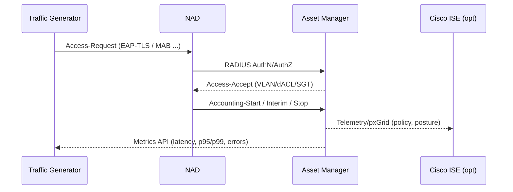

# RadiusForge — Topology Page Wireframe

This wireframe guides the UI implementation of the **Topology** page and doubles as a dev handoff spec.

---

## 1) Goals
- Visualize live flow between **Traffic Generator**, **NADs**, **Asset Manager** (primary), and **Cisco ISE** (optional).
- Show per-node health (green/yellow/red), live RPS/TPS, latency, and error rate.
- Allow click-through to node-specific metrics and logs.
- Support multiple NAD clusters and multi-datacenter views.

---

## 2) Layout (Wireframe)
```
+--------------------------------------------------------------+
|  Top Bar: [Start] [Pause] [Stop]   Run: #123  Preset: 5k RPS |
+------------------------+-------------------------------------+
| Left Pane (Filters)    |  Canvas (Interactive Topology)      |
| - Time window          |  [Traffic Generator] ---> [NAD(s)]  |
| - Traffic type         |         |                   |        |
| - Auth subtype         |         v                   v        |
| - Target (AM/ISE)      |   [Asset Manager] <----> [Cisco ISE] |
| - Datacenter           |         ^                   ^        |
| - Node status          |         |                   |        |
| - Legend               |     [Syslog/SIEM] <--- [NAD(s)]     |
+------------------------+-------------------------------------+
| Bottom Strip (Live KPIs): RPS | TPS | p95 | p99 | Errors | CoA |
+--------------------------------------------------------------+
```

---

## 3) Mermaid Diagram (System Topology)
```mermaid
flowchart LR
  TG[Traffic Generator]:::svc -->|RADIUS/TACACS+| NAD1[NAD Cluster A]
  TG -->|RADIUS/TACACS+| NAD2[NAD Cluster B]
  NAD1 -->|AuthZ/Acct/CoA| AM[Asset Manager]
  NAD2 -->|AuthZ/Acct/CoA| AM
  AM <--> |pxGrid/Policy/Telemetry| ISE[Cisco ISE (optional)]
  NAD1 -->|Syslog| SIEM[(Syslog/SIEM)]
  NAD2 -->|Syslog| SIEM
  
  classDef svc fill:#eef,stroke:#88a,stroke-width:1px;
  classDef comp fill:#efe,stroke:#484,stroke-width:1px;
  classDef opt fill:#ffe,stroke:#aa5,stroke-width:1px,stroke-dasharray:3 3;
  class TG svc;
  class AM comp;
  class ISE opt;
```

---

## 4) Mermaid Diagram (Live Flow Sequence)


---

## 5) Interactions
- **Hover** a link to see real-time metrics (RPS, p95, error%).
- **Click** a node to open a side panel:
  - Node health, recent logs, last errors, configuration snapshot.
- **Drag** to reposition nodes; positions persist per user.
- **Zoom** and **pan** canvas.

---

## 6) Data Binding (Frontend)
- WebSocket feed: `wss://server/telemetry` → push live metrics.
- REST:
  - `GET /api/topology` → nodes, links, health.
  - `GET /api/runs/:id/metrics?range=...` → time series for overlays.
  - `POST /api/nodes/:id/action` → test ping, CoA test, etc.

---

## 7) Status & Legend
- **Green**: < 1% error; p95 < SLO
- **Yellow**: 1–5% error; p95 near SLO
- **Red**: > 5% error; p95 exceeds SLO
- **Dashed**: optional/disabled components (e.g., ISE)

---

## 8) SLO/SLA Defaults (editable)
- p95 Latency (Auth): **< 150 ms**
- p99 Latency (Auth): **< 300 ms**
- Error Rate: **< 1%** sustained
- CoA Latency p95: **< 2 s**

---

## 9) Empty/Loading/Error States
- **Empty**: show sample topology with tips.
- **Loading**: skeleton for nodes/edges.
- **Error**: toast with retry + diagnostics link.

---

## 10) QA Checklist
- Canvas renders 1 → 500 nodes without jank (virtualized).
- Node colors update ≤ 1s from telemetry tick.
- Zoom/pan smooth at 60fps on mid hardware.
- Keyboard nav: Tab cycles nodes; Enter opens panel.
```

# End of Wireframe
